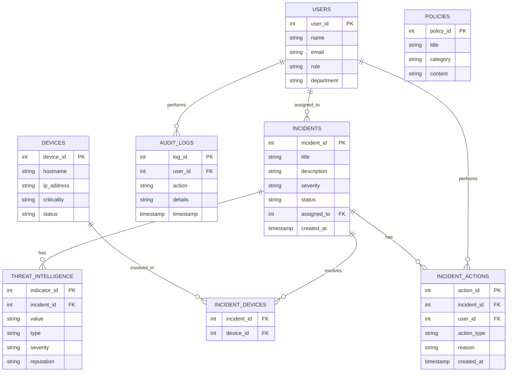

# Securini SOC Assistant — MCP Server

## 1. Company & Problem

**Securini** is a managed security operations company. Its SOC analysts triage
incidents, look up threat intelligence, and take response actions (isolating
devices, closing incidents, escalating) across client environments.

Before this project, analysts worked directly against the security database
and their own judgment calls for anything sensitive. Two mistakes we wanted
to design around:

- **Isolating the wrong device.** Cutting a *Critical* device (e.g. a
  production web server or DB server) off the network is disruptive — it
  should never happen without a human sign-off, but a *Normal* device (e.g.
  an employee laptop) isolating immediately is fine and shouldn't be
  slowed down.
- **Closing incidents that were never actually resolved.** A Junior Analyst
  closing a Critical/High severity incident on their own authority is a
  real risk (an unresolved ransomware incident marked "Closed" is worse
  than no automation at all).

The fix: an LLM-facing MCP server that sits in front of `security.db`
instead of the model touching the database directly, so every write action
goes through the same validation, authorization, and audit logging path a
human analyst would.

## 2. Database & ERD

SQLite (`db/schema.sql` + `db/seed.sql`, built by `db/init_db.py`).



Seed data deliberately covers both edge cases the tools need to react to:
a Critical device (`WEB-SERVER-01`) and a Normal device
(`EMPLOYEE-LAPTOP-22`), plus one High and one Critical severity incident
so `close_incident`'s role check has real cases to hit.

## 3. Protocol Concerns → Where They Live

| Concern | File | How it fires |
|---|---|---|
| **Capability negotiation** | `mcp_server/server.py` (server side), `client/agent.py` (client side) | Real `initialize`/`initialized` handshake. The client reads `init.capabilities` and only calls `list_resources`/`list_prompts` if the server declared them; it only *offers* sampling/elicitation support by passing `sampling_callback` / `elicitation_callback` into `ClientSession` — the server-side tools (`ctx.sample`, `ctx.elicit`) fail gracefully if a connected client didn't. |
| **Notifications** | `mcp_server/tools.py` (role-based tool set, planned) | Tool availability is scoped by session role; a role change pushes `tools/list_changed` instead of the client polling. |
| **Elicitation** | `mcp_server/tools.py` → `isolate_device()` | Trigger: `devices.criticality == 'Critical'`. Calls `await ctx.elicit(...)` with a typed `IsolationApproval` schema, pausing for a Security Manager's yes/no + justification before the device is isolated. A Normal device isolates immediately, no elicitation. |
| **Resources** | `mcp_server/resources.py` | `policy://critical-device-isolation` and `policy://incident-closure` are static policy text served via `resources/read`, not wrapped in a tool — the model reads the policy once and reasons over it rather than calling a function every time. |
| **Prompts** | `mcp_server/prompts.py`, `server.py` (`@mcp.prompt`) | `incident_summary`, `threat_analysis`, `closure_report` are parameterized, discoverable prompt templates surfaced via `prompts/list`. |
| **Transport** | `mcp_server/server.py` | Started on stdio during development, now running Streamable/SSE HTTP (`transport="sse"`) for the deployed version — see commit history for the switch. |
| **Progress tracking** | `mcp_server/progress.py` | `show_progress()` reports incremental `ctx.report_progress()` updates for long-running work instead of leaving the client blocked. |
| **Sampling** | `mcp_server/tools.py` → `generate_closure_report()`, `client/agent.py` → `sampling_callback()` | The server has no LLM of its own. It pulls the real incident record + action log from the DB, builds a prompt, and calls `await ctx.sample(...)`. The **client's** model (via `sampling_callback`, calling the Anthropic API) generates the actual closure report text — the server never writes it itself. |
| **Defensive tool design** | `mcp_server/validation.py`, `mcp_server/tools.py` | Every write tool has a typed Pydantic request model (`extra="forbid"`, `ge=1` on IDs, length limits), re-validated server-side independent of the MCP schema, plus a handler-level authorization check against live DB state (`isolate_device`'s criticality check, `close_incident`'s severity+role check) — not just "the schema says the ID is an int." |

## 4. Read-only vs. Write Tools

| Tool | Type | Requires elicitation? | Requires role check? |
|---|---|---|---|
| `ping` | read | no | no |
| `ip_reputation` | read | no | no |
| `user_history` | read | no | no |
| `isolate_device` | **write** | **yes, if device is Critical** (POLICY-IR-001) | no (elicitation *is* the control) |
| `close_incident` | **write** | no | **yes** — Critical/High severity requires Security Manager role (POLICY-IM-002) |
| `escalate` | write | no | no |
| `notify_user` | write (stub) | no | no |
| `generate_closure_report` | write-adjacent (sampling) | no | no |

**If a connected client doesn't declare a capability one of these tools
needs:**
- No `elicitation_callback` → `isolate_device` on a Critical device catches
  the failure from `ctx.elicit(...)` and returns a clear denial message
  instead of isolating the device or crashing.
- No `sampling_callback` → `generate_closure_report` will error out when it
  calls `ctx.sample(...)`; the tool should not be offered to such a client
  (planned: gate this via `tools/list_changed` based on declared client
  capabilities).

## 5. Project Layout

```
CyberSecurity-Agent/
  db/
    schema.sql
    seed.sql
    init_db.py        # builds security.db from schema.sql + seed.sql
    security.db        # generated, not committed
  mcp_server/
    server.py          # FastMCP instance, resources, prompts, transport
    tools.py            # all @mcp.tool definitions
    db.py                # security.db connection helper
    validation.py         # Pydantic request models
    resources.py           # policy content lookup
    prompts.py               # prompt templates
    progress.py                # progress-reporting helper
    elicitation.py               # console fallback confirm helper
    capabilities.py                # documentation-only capability notes
  client/
    agent.py            # MCP client: handshake, sampling + elicitation callbacks, demo calls
```

## 6. Running It

```powershell
# 1. Build the database (run once, or any time you want to reset it)
cd db
python init_db.py
cd ..

# 2. (optional but needed for real sampling output)
pip install anthropic
setx ANTHROPIC_API_KEY "sk-ant-..."

# 3. Start the server (leave this terminal running)
python -m mcp_server.server

# 4. In a second terminal, run the demo client
python -m client.agent
```

The demo client (`client/agent.py`) exercises every concern in one run:
tool/resource/prompt discovery, a normal-device isolation (no pause), a
critical-device isolation (pauses for elicitation on the client console), an
unauthorized incident closure attempt, an authorized one, an escalation, and
a sampling-backed closure report.

## 7. What We'd Still Worry About in Production

- Elicitation and sampling currently fall back to a console prompt / local
  fallback text — a real deployment needs an actual UI-side approval flow
  and a properly scoped Anthropic API key per session, not a shared one.
- Role is currently passed as a plain `user_id` argument the caller
  supplies; a production version needs real session-bound identity instead
  of trusting the argument.
- `tools/list_changed` for role-based tool visibility is designed but not
  yet wired to a live session/role change event.