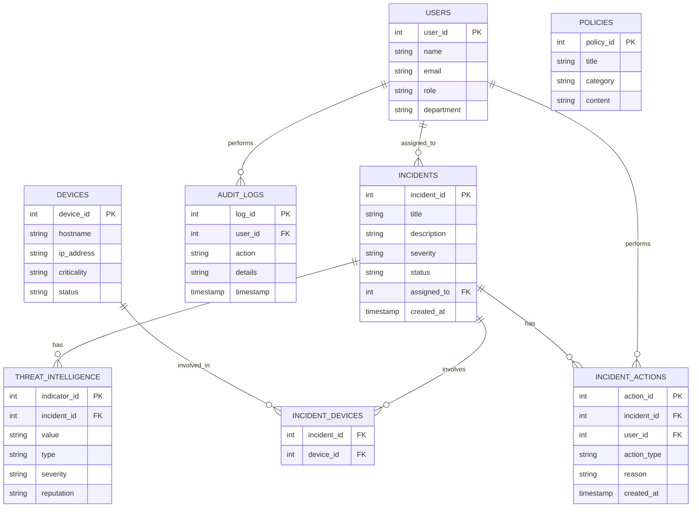

# Securini SOC Assistant — MCP Server

## 1. Company & Problem

**Securini** is a managed security operations company. Its SOC analysts triage
incidents, look up threat intelligence, and take response actions (isolating
devices, closing incidents, escalating) across client environments.

Before this project, analysts worked directly against the security database
and their own judgment calls for anything sensitive. Two mistakes we wanted
to design around:

- **Isolating the wrong device.** Cutting a *Critical* device (e.g. a
  production web server or DB server) off the network is disruptive — it
  should never happen without a human sign-off, but a *Normal* device (e.g.
  an employee laptop) isolating immediately is fine and shouldn't be
  slowed down.
- **Closing incidents that were never actually resolved.** A Junior Analyst
  closing a Critical/High severity incident on their own authority is a
  real risk (an unresolved ransomware incident marked "Closed" is worse
  than no automation at all).

The fix: an LLM-facing MCP server that sits in front of `security.db`
instead of the model touching the database directly, so every write action
goes through the same validation, authorization, and audit logging path a
human analyst would.

## 2. Database & ERD

SQLite (`db/schema.sql` + `db/seed.sql`, built by `db/init_db.py`).

Seed data deliberately covers both edge cases the tools need to react to:
a Critical device (`WEB-SERVER-01`) and a Normal device
(`EMPLOYEE-LAPTOP-22`), plus one High and one Critical severity incident
so `close_incident`'s role check has real cases to hit.

 # CyberSecurity MCP Agent

A Model Context Protocol (MCP) based CyberSecurity Agent designed to simulate a Security Operations Center (SOC) assistant.

The system provides an MCP client that communicates with an MCP server exposing security-related tools connected to a database. The agent can perform security operations such as checking user history, analyzing IP reputation, blocking suspicious IPs, managing incidents, and generating security reports.

---

## Team Members

- **Mariem Gaber**
- **Aser Alaa**

At the beginning of the project, we divided the tasks between us to work on different components independently. After completing the initial parts, we collaborated on integrating all components, debugging issues, improving the architecture, and reaching the final working solution together.

---

# Project Architecture

The project follows an MCP client-server architecture:

CyberSecurity-Agent
│
├── client
│ └── agent.py
│
├── mcp_server
│ └── server.py
│
├── shared
│ └── tools.py
│
└── database
└── security.db

---

# System Components

## 1. MCP Client

The client acts as the user interface and communicates with the MCP server.

Responsibilities:

- Connect to MCP server
- Perform capability checking
- Call available security tools
- Display results to the user

The client initially used **stdio transport** during development and was later migrated to **Streamable HTTP transport**.

---

## 2. MCP Server

The MCP server exposes cybersecurity operations as MCP tools.

Implemented tools:

### User History

Retrieves information about a specific user.

Example:
user_history(user="Mariem Gaber")

---

### IP Reputation

Checks whether an IP exists in the threat intelligence database and retrieves its reputation and severity.

Example:

ip_reputation(ip="192.168.1.50")

---

### Block IP

Blocks a suspicious IP address after validating the request and checking authorization.

The operation includes:

- IP validation
- User authorization verification
- Database state update
- Audit logging

Only users with the **Security Manager** role can perform this operation.

---

### Close Incident

Closes an existing security incident after verifying permissions.

---

### Escalate Incident

Escalates a security incident and records the action.

---

### Send Email

Simulates sending an email notification and stores the action in audit logs.

---

### Generate Security Report

A long-running operation that generates a security report.

The process includes multiple stages:

1. Collecting incident data
2. Analyzing threats
3. Calculating statistics
4. Preparing the final report

The tool uses MCP progress notifications to provide continuous feedback instead of leaving the client waiting without updates.

Example:

Progress: 1/5
Progress: 2/5
Progress: 3/5
Progress: 4/5
Progress: 5/5

Report generated successfully.

---

# Database Layer

The project uses a relational database to store:

- Users
- Devices
- Threat intelligence data
- Security incidents
- Incident actions
- Audit logs

The database is accessed through a shared data layer to separate database operations from MCP communication logic.

---

## 3. Protocol Concerns → Where They Live

| Concern | File | How it fires |
|---|---|---|
| **Capability negotiation** | `mcp_server/server.py` (server side), `client/agent.py` (client side) | Real `initialize`/`initialized` handshake. The client reads `init.capabilities` and only calls `list_resources`/`list_prompts` if the server declared them; it only *offers* sampling/elicitation support by passing `sampling_callback` / `elicitation_callback` into `ClientSession` — the server-side tools (`ctx.sample`, `ctx.elicit`) fail gracefully if a connected client didn't. |
| **Notifications** | `mcp_server/tools.py` (role-based tool set, planned) | Tool availability is scoped by session role; a role change pushes `tools/list_changed` instead of the client polling. |
| **Elicitation** | `mcp_server/tools.py` → `isolate_device()` | Trigger: `devices.criticality == 'Critical'`. Calls `await ctx.elicit(...)` with a typed `IsolationApproval` schema, pausing for a Security Manager's yes/no + justification before the device is isolated. A Normal device isolates immediately, no elicitation. |
| **Resources** | `mcp_server/resources.py` | `policy://critical-device-isolation` and `policy://incident-closure` are static policy text served via `resources/read`, not wrapped in a tool — the model reads the policy once and reasons over it rather than calling a function every time. |
| **Prompts** | `mcp_server/prompts.py`, `server.py` (`@mcp.prompt`) | `incident_summary`, `threat_analysis`, `closure_report` are parameterized, discoverable prompt templates surfaced via `prompts/list`. |
| **Transport** | `mcp_server/server.py` | Started on stdio during development, now running Streamable/SSE HTTP (`transport="sse"`) for the deployed version — see commit history for the switch. |
| **Progress tracking** | `mcp_server/progress.py` | `show_progress()` reports incremental `ctx.report_progress()` updates for long-running work instead of leaving the client blocked. |
| **Sampling** | `mcp_server/tools.py` → `generate_closure_report()`, `client/agent.py` → `sampling_callback()` | The server has no LLM of its own. It pulls the real incident record + action log from the DB, builds a prompt, and calls `await ctx.sample(...)`. The **client's** model (via `sampling_callback`, calling the Anthropic API) generates the actual closure report text — the server never writes it itself. |
| **Defensive tool design** | `mcp_server/validation.py`, `mcp_server/tools.py` | Every write tool has a typed Pydantic request model (`extra="forbid"`, `ge=1` on IDs, length limits), re-validated server-side independent of the MCP schema, plus a handler-level authorization check against live DB state (`isolate_device`'s criticality check, `close_incident`'s severity+role check) — not just "the schema says the ID is an int." |

## 4. Read-only vs. Write Tools

| Tool | Type | Requires elicitation? | Requires role check? |
|---|---|---|---|
| `ping` | read | no | no |
| `ip_reputation` | read | no | no |
| `user_history` | read | no | no |
| `isolate_device` | **write** | **yes, if device is Critical** (POLICY-IR-001) | no (elicitation *is* the control) |
| `close_incident` | **write** | no | **yes** — Critical/High severity requires Security Manager role (POLICY-IM-002) |
| `generate_closure_report` | write-adjacent (sampling) | no | no |

**If a connected client doesn't declare a capability one of these tools
needs:**
- No `elicitation_callback` → `isolate_device` on a Critical device catches
  the failure from `ctx.elicit(...)` and returns a clear denial message
  instead of isolating the device or crashing.
- No `sampling_callback` → `generate_closure_report` will error out when it
  calls `ctx.sample(...)`; the tool should not be offered to such a client
  (planned: gate this via `tools/list_changed` based on declared client
  capabilities).

# MCP Protocol Features Implemented

## 1. Capability Negotiation

The client performs an initialization exchange with the MCP server and checks available tools before using them.

The client retrieves the available server tools dynamically instead of assuming server capabilities.

Example:

Available tools:

user_history
ip_reputation
block
close
escalate
email
security_report

---

## 2. Transport Layer

The project demonstrates both MCP transports:

### Development Phase

Used local STDIO transport:

PythonStdioTransport

### Final Phase

Migrated to remote communication using:

Streamable HTTP Transport

Example:

http://127.0.0.1:8000/mcp

---

## 3. Progress Tracking

Implemented through the `security_report` tool.

The server sends progress updates while performing a multi-step operation, allowing the client to receive feedback during execution.

---

## 4. Defensive Tool Design

The `block` tool follows defensive design principles.

Implemented:

### JSON Schema Constraints

Input validation using structured schemas:

- Valid IP format
- Valid administrator ID

### Server-side Validation

Independent validation inside the tool handler.

### Authorization Checks

The server verifies that the requesting user has the required role:

Security Manager

before allowing sensitive actions.

### Audit Logging

All security-sensitive actions are recorded.

---

# Technologies Used

- Python
- FastMCP
- MCP Protocol
- SQLite Database
- AsyncIO
- Streamable HTTP Transport

---

# Running the Project

## Start MCP Server

python run_server.py

---

## Start Client

python -m client.agent

---

# Example Workflow

1. Client connects to MCP server.
2. Server capabilities are discovered.
3. User selects a security operation.
4. Client calls the corresponding MCP tool.
5. Server validates the request.
6. Database operation is executed.
7. Result is returned to the client.

---

# Future Improvements

- Add more SOC automation tools.
- Integrate real threat intelligence APIs.
- Add authentication tokens for users.
- Improve report generation with machine learning based threat analysis.
  (planned: gate this via `tools/list_changed` based on declared client
  capabilities).

